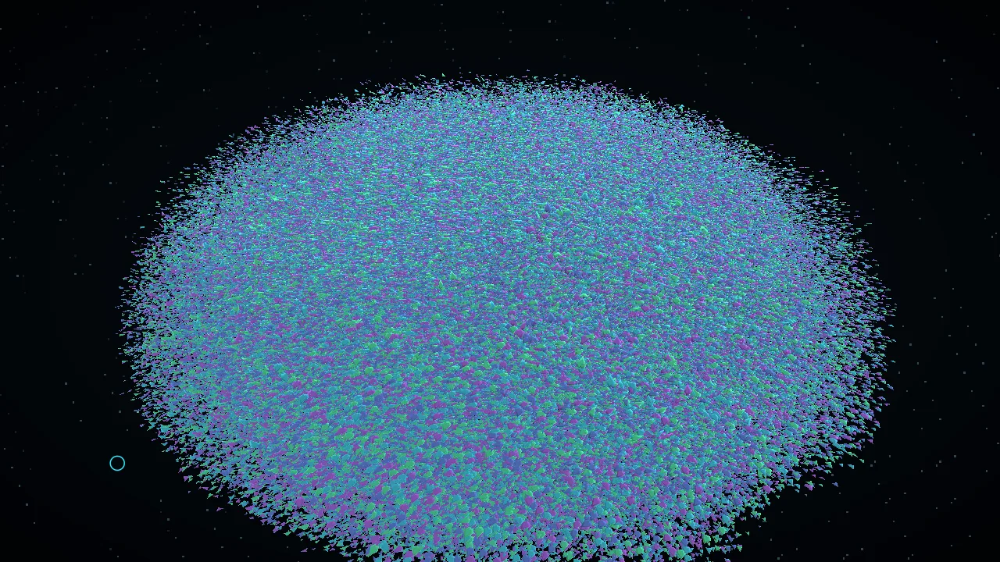
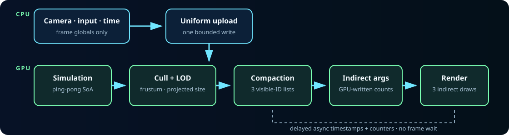

# SwarmGPU

SwarmGPU is a raw WebGPU renderer that simulates, culls, classifies, compacts, and indirectly draws
up to one million simple objects while the CPU handles only frame-global parameters and command
submission.

[**Launch the HTTPS demo**](https://sebastienaglae.github.io/swarm-gpu/) ·
[Architecture](docs/architecture/overview.md) · [Benchmarks](docs/evidence/phase-06/README.md) ·
[Reliability evidence](docs/evidence/phase-07/README.md)

[](docs/media/swarmgpu-showcase.webm)

The poster links to a deterministic ten-second WebM capture. Motion is illustrative; the measured
results below come from committed benchmark reports, not from the video.

## Verified reference results

Reference environment: browser-exposed `nvidia turing` adapter correlated with the host's NVIDIA
GeForce GTX 1650 (4 GiB), Google Chrome 151.0.7922.174 headless, Windows 10.0.26200, AC power,
1920×1080, `timestamp-query` available. Chrome withheld the precise device string, so the inventory
correlation is disclosed rather than presented as browser-reported identity.

| Scenario                 | Instances rendered |       LOD near / mid / far |   Frame p95 | CPU encode + submit median |   GPU median |
| ------------------------ | -----------------: | -------------------------: | ----------: | -------------------------: | -----------: |
| Static renderer baseline |            100,000 |           direct near draw |     17.0 ms |                     0.3 ms |     0.852 ms |
| **Primary target**       |        **250,000** |            250,000 / 0 / 0 | **16.9 ms** |                 **0.3 ms** | **2.621 ms** |
| 1m, forced 10% visible   |            100,000 |    14,859 / 84,070 / 1,071 |     16.9 ms |                     0.3 ms |     1.638 ms |
| 1m, forced 100% visible  |          1,000,000 | 149,859 / 839,567 / 10,574 |     16.9 ms |                     0.3 ms |     6.029 ms |
| Representative LOD scene |            500,000 |   75,024 / 419,639 / 5,337 |     16.9 ms |                     0.3 ms |     3.539 ms |

These are measurements on one machine, not minimum specifications. The primary target report is
[committed as raw samples and metadata](benchmarks/results/phase-06/sim-250k/2026-08-30_8b9ff88_nvidia-turing-chrome-win11.json).
Its identical-contract rerun exposed browser cadence variance and remains documented rather than
discarded. `Readbacks: 0/interactive frame`; telemetry is asynchronous and delayed.

## GPU pipeline



The CPU never loops over active instances after deterministic initialization. One command buffer
orders simulation, culling/LOD classification, finalization, and rendering. WebGPU command ordering
provides synchronization; ping-pong state prevents read/write aliasing, and visibility stays on the
GPU.

## Features

- Raw WebGPU and WGSL: no rendering framework and no WebGL fallback.
- GPU simulation over structure-of-arrays position, velocity, and immutable appearance buffers.
- Conservative frustum culling and projected-size near/mid/far LOD selection.
- Capacity-safe atomic compaction into three GPU-resident visible-ID regions.
- Three GPU-written indexed indirect records and at most three swarm draws.
- Persistent pipelines, bind groups, buffers, descriptors, and attachment ownership.
- Delayed per-pass GPU timestamp telemetry with honest unsupported-device fallback.
- Quantized dynamic resolution with sustained-window hysteresis.
- Bounded device-loss recovery, deterministic scene rebuild, and one-loop ownership.
- Versioned benchmarks, full hardware stress reports, diagnostics export, and visual regression.

## Quick start

Requirements:

- Node.js 22.20.x and npm 11.18.x (the repository pins both contracts).
- A secure context: `localhost` for development or HTTPS in production.
- A browser/device combination exposing WebGPU. The reference browser is Chrome; exact compatibility
  changes over time, so consult the browser's WebGPU status rather than assuming identical limits.

```bash
git clone https://github.com/sebastienaglae/swarm-gpu.git
cd swarm-gpu
npm ci
npm run dev
```

Open the printed localhost URL. If WebGPU, an adapter, or canvas configuration is unavailable, the app
shows an actionable retry screen instead of a blank canvas.

Quality gates:

```bash
npm run check
npm run test:e2e
npm run benchmark:budgets
npm run stress:reports
npm run smoke:production
```

## Controls

| Control        | Behavior                                                        |
| -------------- | --------------------------------------------------------------- |
| Drag / wheel   | Orbit and zoom the camera                                       |
| Pointer force  | Disable, attract, or repel the swarm under the pointer          |
| Population     | Select 10k, 100k, 250k, 500k, or 1m when adapter limits allow   |
| Pause / resume | Freeze simulation without accumulating a resume delta           |
| Reset          | Restore deterministic state and camera                          |
| Render scale   | Select 50–100% internal scale or slow automatic adaptation      |
| Capture mode   | Hide interface chrome for a clean frame                         |
| Export metrics | Download bounded diagnostics, capabilities, and delayed samples |

Unsupported population options are disabled from validated adapter limits; selection never silently
allocates a smaller population.

## Reproduce benchmarks and stress

With `npm run dev -- --host 127.0.0.1 --port 5174` running from a clean checkout:

```bash
node scripts/benchmark-phase-06.mjs http://127.0.0.1:5174/ <clean-commit> smoke
node scripts/benchmark-phase-06.mjs http://127.0.0.1:5174/ <clean-commit> full
npm run stress:quick
npm run stress:full
```

Benchmark mode fixes seed, timestep, camera, input, canvas, scale, population, warm-up, and duration.
The overlay is disabled during measurement; GPU results drain afterward. See the
[benchmark contract](docs/benchmarking/phase-06-runner.md), [evidence policy](docs/benchmarking/evidence-policy.md),
and [stress protocol](docs/testing/phase-07-stress.md).

## Architecture and memory

Per capacity instance, SwarmGPU owns 32 bytes of ping-pong positions, 32 bytes of ping-pong
velocities, 16 bytes of immutable appearance, and 12 bytes across three full-capacity visible-ID
regions: **92 bytes/instance**. One-million tracked state is 92,000,108 bytes (87.74 MiB), excluding
browser/driver internals and attachments.

Pass ordering, layouts, synchronization, telemetry, and lifecycle are documented in the
[architecture overview](docs/architecture/overview.md). Key decisions include
[raw WebGPU](docs/architecture/decisions/0001-raw-webgpu.md),
[structure of arrays](docs/architecture/decisions/0002-structure-of-arrays.md), and
[rendering conventions](docs/architecture/decisions/0003-rendering-conventions.md).

## Evidence-driven optimization

| Experiment                           |                                Before |                       After | Decision / comparable evidence                                                 |
| ------------------------------------ | ------------------------------------: | --------------------------: | ------------------------------------------------------------------------------ |
| Timestamp readback cadence, SIM-250K | frame p95 33.3 ms at 15-frame cadence | 16.9 ms at 60-frame cadence | Retain delayed 60-frame sampling; [analysis](docs/evidence/phase-06/README.md) |
| 1m visibility                        |                  6.029 ms GPU at 100% |         1.638 ms GPU at 10% | GPU culling materially reduces render/atomic work                              |
| 500k internal scale                  |                3.539 ms GPU at native |         2.818 ms GPU at 50% | Adapt only when raster-bound; never hide native results                        |
| Workgroup size 128 vs 256            |                              3.473 ms |                    3.408 ms | Difference too noisy/small; retain simpler 128 default                         |

Packing, AoS conversion, render bundles, and prefix-scan compaction were rejected for v1 because the
measured simulation/CPU/culling costs did not justify added complexity.

## Browser support and limitations

- WebGPU and a secure context are mandatory. There is no WebGL fallback.
- Adapter capacity, performance, scheduling, thermals, and driver behavior vary materially.
- `timestamp-query` is optional; GPU timings show unavailable when unsupported.
- Visible and per-LOD diagnostics are intentionally delayed and therefore approximate snapshots.
- The renderer uses an opaque canvas and opaque geometry; transparency sorting is outside v1 scope.
- Dynamic resolution changes only internal raster size and is disabled in deterministic benchmarks.
- Automatic recovery is bounded and cannot guarantee recovery from every physical driver failure.
- The reference matrix covers one discrete GPU/browser path; broader compatibility reports are
  welcome through the issue template.

## Release, contribution, and governance

- [Changelog](CHANGELOG.md) and [v1.0 release notes](RELEASE_NOTES.md)
- [Hosting and rollback](docs/hosting.md)
- [Contributing](CONTRIBUTING.md), [security](SECURITY.md), and
  [code of conduct](CODE_OF_CONDUCT.md)
- [MIT license](LICENSE) and [third-party/asset notices](THIRD_PARTY_NOTICES.md)
- [Implementation phases](docs/phases/00-product-contract.md) and optional
  [post-v1 research](docs/phases/09-research-extensions.md)

SwarmGPU is deliberately specialized: one mesh family, one large population, a GPU-owned visibility
pipeline, and measurable behavior. Phase 09 experiments remain isolated from the v1 core.
