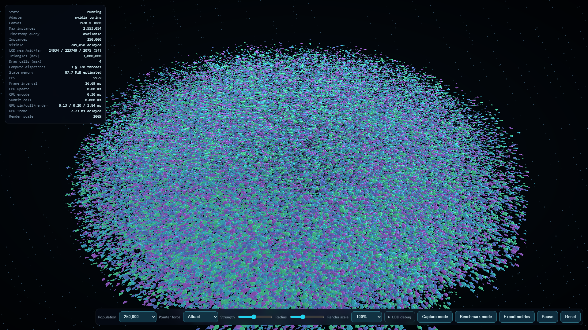

# Phase 06 evidence

Reference environment: NVIDIA Turing adapter, Google Chrome 151 headless, Windows 10.0.26200,
1920×1080 unless the scenario name says otherwise. Reports contain raw samples and exact metadata.

## Primary target

`SIM-250K` at native 1920×1080 on commit `8b9ff88` measured a 16.7 ms median / 16.9 ms p95 display
interval, 0.3 ms median CPU encode-and-submit, and 2.621 ms median delayed GPU total. This demonstrates
the 250,000-instance/60-FPS gate with substantial GPU headroom. A later identical run at `4b14b9d`
kept a 16.7 ms median and 2.556 ms GPU median but showed 33.3 ms p95 rAF cadence despite only 37 frames
above 33.4 ms; the raw histogram is retained rather than hidden. GPU workload timing did not indicate
saturation, so the README headline uses the reproducible passing reference and discloses the rerun.

## Final matrix (`4b14b9d`)

| Scenario       | Frame median / p95 ms | GPU median / p95 ms | CPU encode+submit median ms |
| -------------- | --------------------: | ------------------: | --------------------------: |
| STATIC-100K    |           16.7 / 17.0 |       0.852 / 1.245 |                         0.3 |
| SIM-250K       |           16.7 / 33.3 |       2.556 / 5.636 |                         0.3 |
| CULL-1M-10     |           16.7 / 16.9 |       1.835 / 2.621 |                         0.3 |
| CULL-1M-100    |           16.7 / 16.9 |       5.767 / 9.306 |                         0.3 |
| LOD-500K       |           16.7 / 16.9 |       3.473 / 6.685 |                         0.3 |
| SCALE-500K-720 |           16.7 / 16.9 |       2.621 / 5.505 |                         0.3 |
| SCALE-500K-50  |           16.7 / 16.8 |       2.818 / 4.063 |                         0.3 |
| LOD-500K-WG256 |           16.7 / 16.9 |       3.408 / 4.850 |                         0.3 |

## Decisions backed by measurements

| Experiment                                |                        Before |               After | Decision                                                                       |
| ----------------------------------------- | ----------------------------: | ------------------: | ------------------------------------------------------------------------------ |
| Telemetry every 15 vs 60 frames, SIM-250K | frame p95 33.3 ms (`5b33b07`) | 16.9 ms (`8b9ff88`) | sample every 60 frames                                                         |
| Workgroup 128 vs 256, LOD-500K            |           GPU median 3.473 ms |            3.408 ms | retain 128; difference is too small/noisy to justify variant complexity        |
| 1M visibility 10% vs 100%                 |           GPU median 1.835 ms |            5.767 ms | GPU culling is material; atomic/render cost scales with visibility             |
| 500K native vs 50% internal scale         |           GPU median 3.473 ms |            2.818 ms | dynamic scale is useful only when raster-bound; native result remains headline |

Packing, SoA-to-AoS conversion, render bundles, and prefix-scan compaction were not added: simulation
is ~0.13 ms at 250k, CPU encoding is ~0.3 ms, and the 1M culling path is not the measured primary
bottleneck. A second representative GPU was unavailable, so workgroup conclusions are explicitly
limited to the reference adapter.

The dynamic-resolution hardware check kept scale 1.0 at 4K because measured GPU time stayed below
the downscale threshold. Unit tests separately prove sustained-window hysteresis, quantization, and
bounds; no artificial slowdown is used to manufacture a flattering adaptive result.

